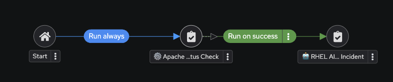
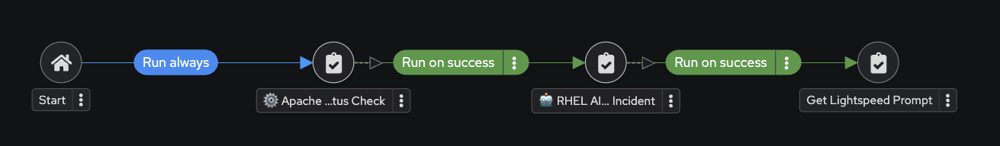
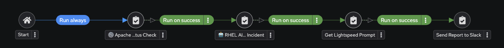

## Steps to configure Ansible Automation Platform

This demo is based out on a catalog item available on RHDP

🚀 Prerequisites

- Access to RHDP Catalog

- Red Hat account with valid credentials

- Slack token (for sending notifications via Slack)

---

### 📦 Step 1: Order RHDP Catalog Item

- Order order this catalog item [RHDP](https://catalog.demo.redhat.com/catalog?search=ai+driven&item=babylon-catalog-prod%2Fsandboxes-gpte.ai-driven-ansible-automation.prod)
with default values

- Once the catalog item is ready, head over to the lab environment.

---

### 🔑 Step 2: Login to AAP

- Open the AAP Web UI.

- Login using the provided credentials.

---
### 📂 Step 3: Create Project

I. Navigate to: Automation Execution → Projects → Create Project.

II. Fill in the details:

| Parameter             | Value                                               |
   |-----------------------|-----------------------------------------------------|
   | Name                  | MyProject                                           |
   | Organization          | Default                                             |
   | Source Control Type   | Git                                                 |
   | Source Control URL    | https://github.com/saahmd/LLamaonOpenshift.git      |

III. Save and verify that **MyProject** status is **Success**.  

---

### 📝 Step 4: Create Job Templates

I. Navigate to **Automation Execution → Templates → Create Job Template**  

Fill in:  

   | Parameter       | Value                                |
   |-----------------|--------------------------------------|
   | Name            | Get Lightspeed Prompt                |
   | Inventory       | Demo Inventory                       |
   | Project         | MyProject                            |
   | Playbook        | playbooks/aap_create_job_template.yml |
   | Credentials     | AAP                                  |

##### Save template.  

II. Create "Send Report to Slack" Template

   | Parameter       | Value                                |
   |-----------------|--------------------------------------|
   | Name            | Send Report to Slack                 |
   | Inventory       | Demo Inventory                       |
   | Project         | MyProject                            |
   | Playbook        | playbooks/send_report_slack.yml      |
   | Credentials     | AAP                                  |
   | Extra variables | `slack_token: "<YOUR SLACK TOKEN>"`  |

*Click **[URL](./Slack_Token.md)** for instructions to get Slack Token*

III. Create "Agent RCA" Template

   | Parameter       | Value                                |
   |-----------------|--------------------------------------|
   | Name            | Agent                |
   | Inventory       | Demo Inventory                       |
   | Project         | MyProject                            |
   | Playbook        | playbooks/rca.yml      |
   | Credentials     | AAP                                  |
   | Extra variables | `llama_stack_url: "<YOUR LLAMA STACK URL>"`  |

IV. Rename ⚙️ Build HTTPD Remediation Template and edit the playbook

Navigate to **Automation Execution → Templates → ⚙️ Build HTTPD Remediation Template → Edit Template

   | Parameter       | Value                                |
   |-----------------|--------------------------------------|
   | Name            | ⚙️ Build Template            |
   | Inventory       | Demo Inventory                       |
   | Project         | **MyProject**                          |
   | Playbook        | **playbooks/httpd_remediation_job_template.yml** |
   | Credentials     | AAP                                  |

V. Rename the ⚙️ Apache Service Status Check template to Service Status Check
    
##### Save template.  

--- 

### 🔄 Step 5: Create AI Insights Workflow 

1. Navigate to **Automation Execution → Templates → Create → Workflow Job Template**.  

2. Fill in:  
    
   | Parameter    | Value                                        |
   |--------------|----------------------------------------------|
   | Name         | AI Insights and Lightspeed prompt generation |
   | Organization | Default        

3. Click **Create workflow job template**.  

4. You’ll see the empty workflow visualizer.

5. Click Add Step button and fill in the below details:

   | Parameter         | Value                                        |
   |-------------------|----------------------------------------------|
   | Node type         | Job Template |
   | Job Template | Service Status Check   |
   | Convergence         | Any |
   | Node alias | (You can leave this blank)   |

6. Click Next, then Finish.

7. Visual after first node:

8. Add Agent RCA step:

    I. Click on the three dots (⋮ kebab menu) next to the ⚙️ Apache Service Status Check node.

    II. Click on ⊕ Add step and link to insert the next node into the workflow.

   | Parameter         | Value                                        |
   |-------------------|----------------------------------------------|
   | Node type         | Job Template |
   | Job Template | Agent RCA   |
   | Status        |  Run on success    |
   | Convergence         | Any |
   | Node alias | (You can leave this blank)   |

    III. Click Next, then Finish.

    Workflow with two nodes:

9. Add "Get Lightspeed Prompt" Template

    I. Click on the three dots (⋮ kebab menu) next to the 🤖 RHEL AI: Analyze Incident node.

    II. Click on ⊕ Add step and link to insert the next node into the workflow.

   | Parameter         | Value                                        |
   |-------------------|----------------------------------------------|
   | Node type         | Job Template |
   | Job Template | Get Lightspeed Prompt   |
   | Status        |  Run on success    |
   | Convergence         | Any |
   | Node alias | (You can leave this blank)   |

    III. Click Next, then Finish.

   Workflow with three nodes:
   
   

1. Add "Send Report to Slack " Template

    I. Click on the three dots (⋮ kebab menu) next to the 🤖 RHEL AI: Analyze Incident node.

    II. Click on ⊕ Add step and link to insert the next node into the workflow.

   | Parameter         | Value                                        |
   |-------------------|----------------------------------------------|
   | Node type         | Job Template |
   | Job Template | Send Report to Slack    |
   | Status        |  Run on success    |
   | Convergence         | Any |
   | Node alias | (You can leave this blank)   |

    III. Click Next, then Finish.

   Workflow with three nodes:
   
   

11) Click Save to finalize.

---
---

## Create Remediation Workflow 

1. Log in to the web UI for Ansible Automation Platform if you are not already logged in.

2. In the left navigation menu, click on Automation Execution → Templates.

3. Click Create template → Create workflow job template.

4. Fill in the details:

   | Parameter         | Value                                        |
   |-------------------|----------------------------------------------|
   | Name         | Remediation Workflow |

5. Select Prompt on Launch Checkbox.

6. Click "Save workflow job template".

7. You’ll see the empty workflow visualizer.

8. Click on the blue Add step. 

    I. Fill out the following values

   | Parameter         | Value                                        |
   |-------------------|----------------------------------------------|
   | Node type         | Job Template |
   | Job Template | 🧾 Commit Fix to Gitea   |
   | Convergence         | Any |
   | Node alias | (You can leave this blank)   |

   II. Click on the blue Next. Review and click the blue Finish button

   Your workflow will now look like this:

   

9. Add "Project Sync" Node

    I. Click on the three dots (kebab menu) next to the 🧾 Commit Fix to Gitea

    II. Click on ⊕ Add step and link. Fill out the following values

    | Parameter         | Value                                        |
   |-------------------|----------------------------------------------|
   | Node type         | Project Sync |
   | Job Template |  Lightspeed-Playbooks  |
   | Status        |  Run on success
   | Convergence         | Any |
   | Node alias | (You can leave this blank)   |

    III. Click on the blue Next.

    IV. Review and click the blue Finish button.

   Your workflow will now look like this:

   

11) Add "⚙️ Build Template" Node

    I. Click on the three dots (kebab menu) next to the 🧾 Commit Fix to Gitea

    II. Click on ⊕ Add step and link. Fill out the following values

    | Parameter         | Value                                        |
    |-------------------|----------------------------------------------|
    | Node type         | Project Sync |
    | Job Template |  ⚙️ Build Template  |
    | Status        |  Run on success |
    | Convergence         | Any |
    | Node alias | (You can leave this blank)   |

    III. Click on the blue Next.

    IV. Review and click the blue Finish button.

    Your workflow will now look like this:
    
    

##### Once you have completed all the prerequisites move on to the [Trigger the workflow](../Readme.md#-prerequisites) section.
