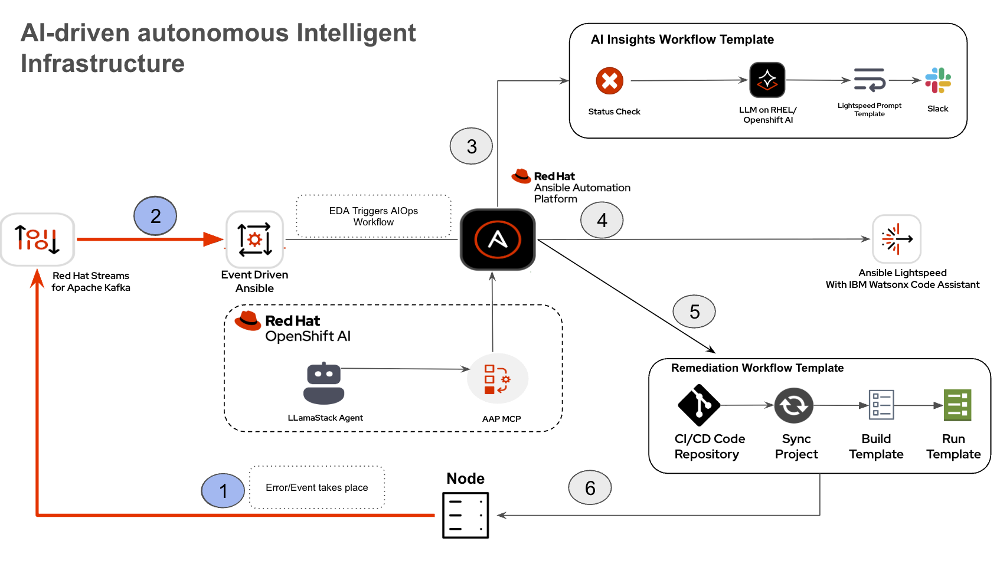
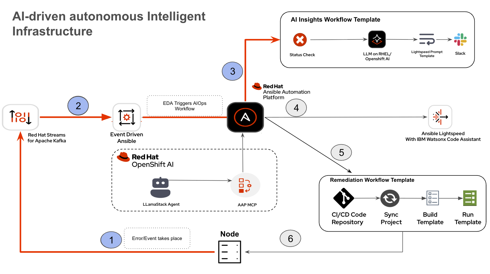
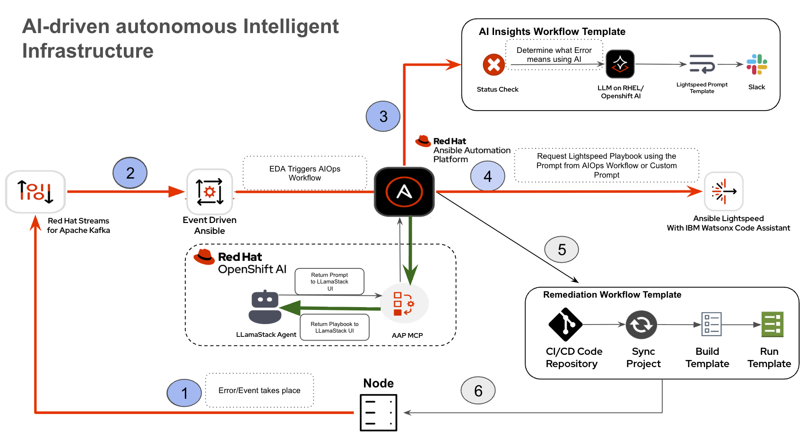

# AIOps Automation Solution with Ansible Automation Platform & LlamaStack on OpenShift

## 📌 Overview
This project demonstrates an **end-to-end AIOps automation framework** built using:
- **Ansible Automation Platform (AAP)**
- **OpenShift** 

The solution automates detection, analysis, notification, and remediation of node/service failures (e.g., HTTP service downtime).

---

## ⚙️ Workflow


This workflow automates the process of detecting, analyzing, and remediating service outages using a combination of Ansible Automation Platform, Event-Driven Ansible, Openshift AI and LLamaStack.

---

**1. Alert & Trigger**

Kafka detects a service outage and sends an alert. Event-Driven Ansible (EDA) picks up this alert, triggering the **AI Insights Workflow** in Ansible Automation Platform (AAP).


**2. AI Analysis**

The **AI Insights Workflow** starts by sending the error to a large language model (LLM) for **Root Cause Analysis (RCA)**. It then uses the RCA to generate a prompt for creating a remediation playbook.



**3. Notification & Review**

Simultaneously, the system notifies the Network Operations Center (NOC) engineer via Slack about the service issue. The engineer can review the RCA-generated prompt and recent events using the **LlamaStack Agent UI**.



**4. Playbook Generation**

The engineer uses the **Lightspeed Generation Template** in AAP to connect with **Lightspeed**, which uses the prompt to generate a remediation playbook. This playbook is displayed on the LlamaStack UI for review.



**5. Playbook Approval & Execution**

After the engineer approves the generated playbook, they trigger the **Remediation Workflow**. This workflow automatically pushes the playbook to Git and syncs the AAP project.


**6. Remediation**

Finally, the workflow creates and runs a job template with the new playbook. This action executes the remediation steps, resolving the service outage.


## Steps to Run the Workflow:

### ✅ Prerequisites

Before you begin, ensure you have the following configured:

- **LlamaStack** on OpenShift → [OpenShift setup steps](./openshift/README.md)  
- **Ansible Automation Platform (AAP)** → [AAP setup steps](./AAP/Readme.md)  

---
---

### 🚀 Steps to Run the Workflow

#### Step 1: Trigger the Workflow

1. **Run the Break Apache Job Template**  
   - Execute the job template ❌ **Break Apache**.  
   - This inserts an invalid directive into the Apache configuration and restarts the service, causing an intentional failure.


2. **Verify Event Pickup in Event-Driven Ansible (EDA)**  
   - Navigate to **Automation Decisions → Rulebook Activations**.  
   - Confirm that **EDA** has detected and picked up the event.


3. **Confirm Workflow Execution in AAP Controller**  
   - Go to **Automation Controller → Jobs**.  
   - Look for the workflow named **AI Insights and Lightspeed Prompt Generation**.  
   - ✅ A successful run will be marked **green**.


4. **Check for Auto-Generated Remediation Template**  
   - Navigate to **Templates** in AAP.  
   - You should now see a new job template:  
     - 🧠 **Lightspeed Remediation Playbook Generator**


5. **Review Slack Notifications**  
   - Open your Slack channel and review the automated notification.  
   - Key details included:  

     - 🛑 **HTTPD Error Logs**  
       Logs automatically collected from the webserver showing the failure.  

     - 🧠 **AI Insights (RCA)**  
       Red Hat AI parsed the logs and generated a **Root Cause Analysis (RCA)** explaining why the failure occurred.  


By following these steps, you will have:  
- Simulated an Apache service failure.  
- Verified that **EDA** captured the event.  
- Executed an **AI-assisted remediation workflow** in AAP.  
- Received **automated RCA insights** and a **generated remediation playbook template** via **Lightspeed**.  
- Notified your team with contextual insights directly in **Slack**.  

---

#### Step 2 - Remediation Workflow

1. **Login to OpenShift Container Platform**  
   Use your provided credentials to log in.

2. **Navigate to the LlamaStack UI**  
   - Go to **Networking → Routes**.  
   - Click on the route next to **Streamlit**. This opens the **LlamaStack UI**.

3. **Configure MCP Server**  
   - In the UI, select **Tools**.  
   - Choose **mcp:aap** under **MCP Servers**.  
   - Increase **Max Token** to at least **2000**.

4. **Interact with AAP MCP Server**  

   You can now issue prompts directly to the AAP MCP server.  

   Enter the following prompts in sequence:
   **Prompt 1** 
   ```text
   1. List the most recent Event.
   ```

   Expected Response

   

   **Prompt 2**
   ```text
   2. "Return the LLM Prompt generated"
   ```
   
   Expected Response
   
   


   > **Important:**  
   > Before proceeding to the next step, **refresh the UI**.  
   > This is required because the underlying LLM in **LlamaStack** may hallucinate if the context length is exceeded.

   **Prompt 3**
   ```text
      Run a Lightspeed job template with ID 19 with extra_vars
      {
      "lightspeed_prompt": "Remove the invalid directive 'InvalidDirectiveHere' from the httpd configuration file. Then restart the httpd service. Execute against node 1 `         host"
      }
      and then give the generated playbook
   ```

   
   The prompt is the same as in Response 2, but with "Execute against Node 1" added, since the HTTP service is down on Node 1 and the playbook should target it.


   **Prompt 4**
   ```text
   Run Remediation Workflow  Template  extra_vars is 
   
   { "lightspeed_playbook": <cleaned_yaml> }
   ```
      
   **Prompt 5**

   ```text
   Run a job template by name Execute HTTPD Remediation
   ```
